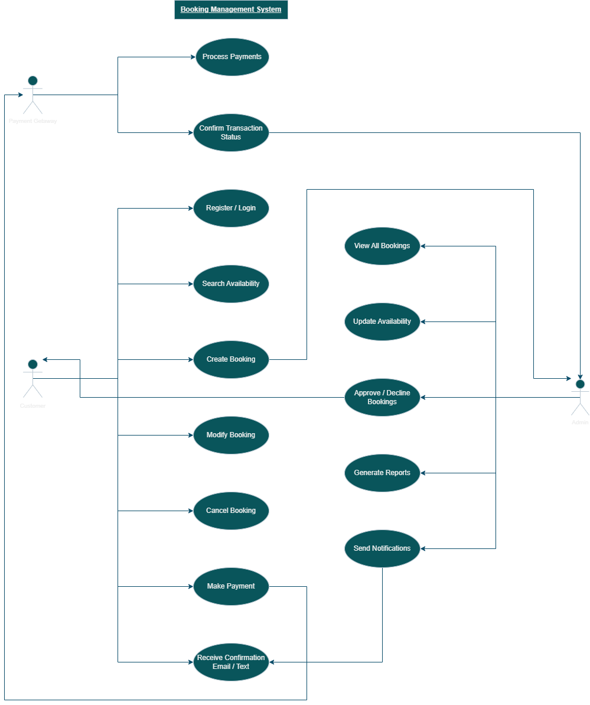

# Requirement Analysis in Software Development

## Introduction
This repository explores the **Requirement Analysis phase** of the **Software Development Life Cycle (SDLC)**.  
It serves as a structured guide for understanding how to gather, document, and analyze software requirements effectively.

The goal is to create a clear blueprint that forms the foundation for successful software projects—ensuring all stakeholders have a shared understanding of project needs, scope, and objectives.

This repository will include:
- Detailed documentation of functional and non-functional requirements  
- Use case descriptions and diagrams  
- Acceptance criteria and analysis notes  

By the end of this project, learners will gain hands-on experience in **defining, organizing, and visualizing** system requirements using industry-standard practices.

---

## What is Requirement Analysis?

**Requirement Analysis** is a crucial phase in the **Software Development Life Cycle (SDLC)** where the project’s goals, functions, and constraints are clearly defined and documented.  
It focuses on understanding **what the users need** from the system and translating those needs into **clear, actionable requirements** that guide the design and development process.

During this phase, developers, analysts, and stakeholders work together to gather, analyze, and validate the system’s requirements. This ensures that the final product aligns with user expectations and business objectives.

### Key Activities in Requirement Analysis
- **Requirement Gathering:** Collecting information from stakeholders through interviews, surveys, or observation.  
- **Requirement Documentation:** Creating detailed records of all requirements in a structured format.  
- **Requirement Validation:** Ensuring the documented requirements are complete, consistent, and feasible.  
- **Requirement Prioritization:** Ranking requirements based on importance and impact on project success.

### Importance in the SDLC
Requirement Analysis acts as the **foundation** of the entire software project. Without a clear understanding of what the system should do, development teams risk building products that fail to meet user needs.

Some key benefits include:
- **Clarity:** Ensures all stakeholders share a common understanding of project goals.  
- **Efficiency:** Reduces rework by identifying issues early before coding begins.  
- **Traceability:** Provides a reference for design, development, and testing.  
- **Risk Reduction:** Prevents scope creep and ensures alignment with business objectives.

In essence, Requirement Analysis transforms abstract ideas into **structured blueprints** that guide the successful creation of software systems.

---

## Why is Requirement Analysis Important?

Requirement Analysis is one of the most critical stages in the **Software Development Life Cycle (SDLC)** because it sets the direction and scope for the entire project. A well-executed analysis ensures that the final software product meets both **user expectations** and **business goals**.  

Below are some of the main reasons why Requirement Analysis is so important:

### 1. Establishes Clear Project Goals
Requirement Analysis defines *what the software should do* and *why it’s being developed*. By gathering and analyzing user needs, teams create a shared understanding of the system’s objectives — reducing confusion and miscommunication among stakeholders.

### 2. Prevents Costly Errors and Rework
Identifying issues or misunderstandings early in the SDLC is far cheaper and faster than fixing them later during development or after deployment. Proper requirement analysis minimizes risks of rework, budget overruns, and project delays by addressing potential problems upfront.

### 3. Ensures User Satisfaction
When user requirements are thoroughly analyzed and validated, the end product aligns closely with what users actually need. This increases user satisfaction, improves adoption rates, and builds trust between developers and clients.

### 4. Guides Design, Development, and Testing
Well-documented requirements serve as a **blueprint** for all subsequent stages of the SDLC. Developers use them to design features, testers use them to create test cases, and managers use them to measure progress — ensuring the entire process stays aligned with project goals.

### 5. Enhances Communication and Collaboration
Requirement Analysis fosters collaboration between stakeholders, clients, and the technical team. It helps bridge the gap between *business language* and *technical specifications*, ensuring that everyone understands the project scope and expectations.

---

> In summary, **Requirement Analysis is the backbone of successful software development**, ensuring that projects are delivered on time, within scope, and with maximum impact.

---

## Key Activities in Requirement Analysis

The Requirement Analysis phase involves several critical activities that ensure software requirements are accurately identified, documented, and validated before development begins. Each activity plays a unique role in defining what the system should achieve and how it will function.

Here are the five key activities involved in Requirement Analysis:

### 1. Requirement Gathering
- This is the first step in understanding the needs of users and stakeholders.
- It involves collecting information from various sources such as interviews, questionnaires, surveys, workshops, and existing documentation.
- The goal is to obtain a clear understanding of user expectations and business goals.

### 2. Requirement Elicitation
- Elicitation focuses on discovering the underlying needs, constraints, and motivations behind user requirements.
- It goes beyond what users *say* they want to identify what they *actually need*.
- Techniques include brainstorming, prototyping, observation, and use case analysis.

### 3. Requirement Documentation
- All gathered and elicited requirements are formally recorded in a structured format for clarity and traceability.
- Documentation may include **Software Requirement Specification (SRS)** documents, **use cases**, and **user stories**.
- Proper documentation ensures all stakeholders share a common understanding of the system’s goals and functionalities.

### 4. Requirement Analysis and Modeling
- This step involves studying, categorizing, and prioritizing the gathered requirements to ensure they are consistent, complete, and achievable.
- Requirements are modeled using diagrams such as **use case diagrams**, **data flow diagrams (DFDs)**, and **entity-relationship diagrams (ERDs)**.
- Modeling helps visualize how different parts of the system interact, improving clarity for both developers and stakeholders.

### 5. Requirement Validation
- Validation ensures that the documented requirements truly reflect user and business needs.
- It involves reviewing, verifying, and confirming requirements with stakeholders through meetings, walkthroughs, and reviews.
- The goal is to identify and correct any gaps, conflicts, or ambiguities before moving into the design phase.

---

> Together, these activities form a structured approach to capturing and managing software requirements, reducing risks, and ensuring the development process starts on a solid foundation.

---

## Types of Requirements

In software development, requirements are generally categorized into two main types: **Functional Requirements** and **Non-functional Requirements**.  
Understanding the difference between the two is essential for designing a system that is both effective and efficient.

### Functional Requirements

**Definition:**  
Functional requirements describe **what the system should do** — the specific features, tasks, and operations it must perform to fulfill user and business needs.  
They focus on the **actions and behaviors** of the system.

**Examples (Booking Management System):**
- The system should allow users to **create new bookings** for available rooms or services.  
- The system should enable users to **search for bookings** using filters such as date, booking ID, or customer name.  
- The system should allow users to **modify or cancel existing bookings** before the scheduled date.  
- The system should send **email confirmations and notifications** to customers after successful booking or cancellation.  
- Administrators should be able to **view all bookings** and manage availability calendars.  

**Purpose:**  
These requirements ensure that the system delivers the intended functionality and provides value to its end users.

### Non-functional Requirements

**Definition:**  
Non-functional requirements describe **how the system performs** its functions rather than what it does.  
They define the **quality attributes** of the system — such as performance, security, usability, and reliability.

**Examples (Booking Management System):**
- The system should **load search results within 3 seconds** under normal network conditions.  
- The platform must be **available 99.9% of the time**, ensuring minimal downtime.  
- User data must be **encrypted using SSL/TLS** protocols for security.  
- The system interface should be **responsive and accessible** on both desktop and mobile devices.  
- The application should support **up to 10,000 concurrent users** without performance degradation.  
- The system should have a **user-friendly interface** that requires minimal training to use.  

**Purpose:**  
These requirements ensure the system delivers a high-quality experience — reliable, fast, secure, and user-friendly.

---

> In summary, **Functional Requirements** define *what* the system should do, while **Non-functional Requirements** define *how well* it should perform those functions.  
Both are essential to delivering a complete and successful Booking Management System.

---

## Use Case Diagrams

**Use Case Diagrams** are visual representations used in **Requirement Analysis** to show how different **actors** (users or external systems) interact with the system to achieve specific goals.  
They provide a high-level overview of **system functionality** and help identify all the possible interactions between users and the system.

### Benefits of Use Case Diagrams
- **Simplifies Communication:** Helps stakeholders quickly understand the system’s capabilities and interactions.  
- **Defines System Scope:** Clarifies what the system will and will not do.  
- **Supports Requirement Validation:** Ensures all functional requirements are accounted for.  
- **Guides Design and Testing:** Serves as a reference point for developers and testers when implementing and verifying features.

---

### Actors in the Booking Management System
1. **Customer** – Makes and manages bookings.  
2. **Administrator** – Oversees all bookings, manages availability, and updates system information.  
3. **Payment Gateway** – Handles secure transactions between the user and the system.

---

### Main Use Cases
- Create a booking  
- Modify or cancel booking  
- Search for available slots or rooms  
- View booking details  
- Process payment  
- Send confirmation or notification emails  
- Manage bookings and availability (Admin)

### Use Case Diagram

Below is the Use Case Diagram for a **Booking Management System**.

**Explanation:**  
In this diagram:
- The **Customer** interacts with use cases such as *Create Booking*, *Modify Booking*, *Cancel Booking*, *Search Availability*, and *Make Payment*.  
- The **Administrator** manages *View All Bookings*, *Update Availability*, and *Send Notifications*.  
- The **Payment Gateway** processes payments when customers make bookings.

This visualization makes it easier to understand user interactions at a glance and ensures no major user flow is overlooked during the design phase.

---

### Acceptance Criteria

**Acceptance Criteria** are the predefined conditions or requirements that a software feature must meet to be considered complete and satisfactory.  
They serve as a bridge between developers, testers, and stakeholders, ensuring everyone has a shared understanding of what success looks like for each feature.  

#### Importance of Acceptance Criteria in Requirement Analysis

- **Clarity and Alignment:** They help align the development team and stakeholders on what needs to be delivered, reducing misunderstandings.  
- **Validation of Requirements:** They make it easier to verify that all functional and non-functional requirements have been met before deployment.  
- **Basis for Testing:** Acceptance criteria guide the creation of test cases to confirm that features work as expected.  
- **Efficient Development:** They help developers stay focused on well-defined outcomes, improving productivity and quality.  

#### Example: Checkout Feature (Booking Management System)

**Feature:** User Checkout  

**Acceptance Criteria:**  
1. The user must be able to review booking details (room type, dates, total price) before confirming.  
2. The system must display all accepted payment methods (e.g., credit card, PayPal, or mobile money).  
3. The checkout form must validate user information (name, email, and payment details) before processing.  
4. Upon successful payment, a confirmation email with booking details must be sent to the user.  
5. The system must update the room’s availability status immediately after checkout completion.  
6. If payment fails, the system must display an appropriate error message and prompt the user to retry.

---
